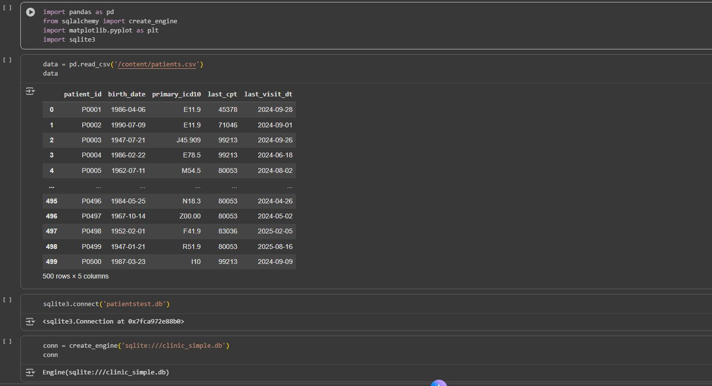
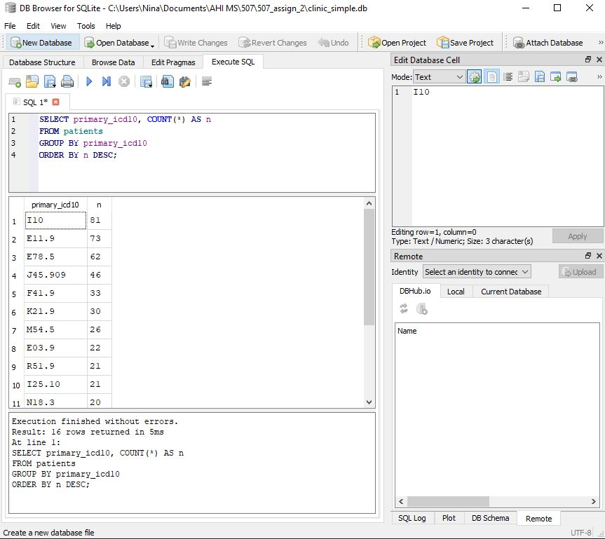
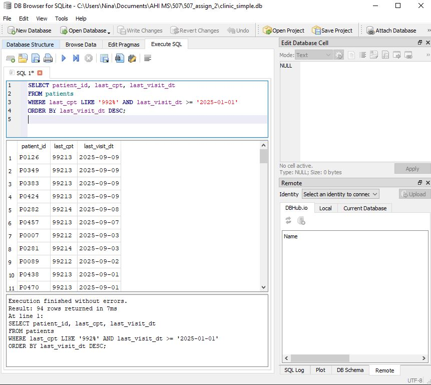
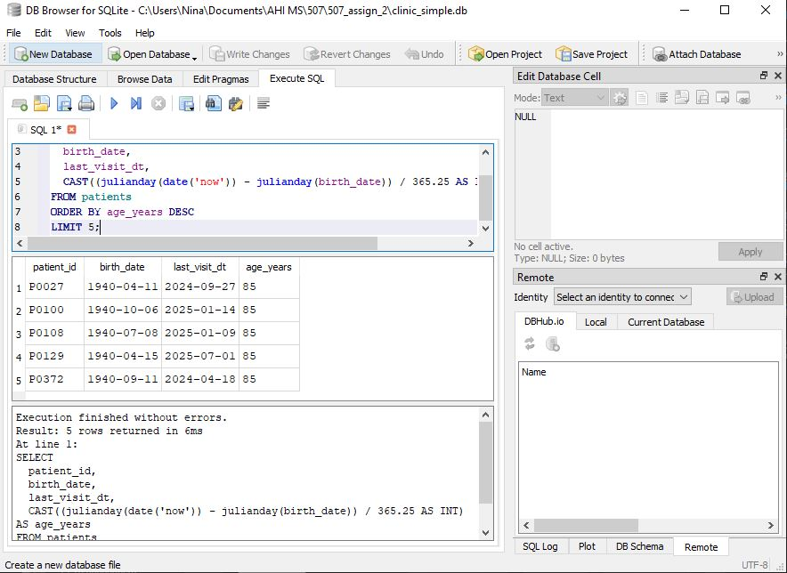
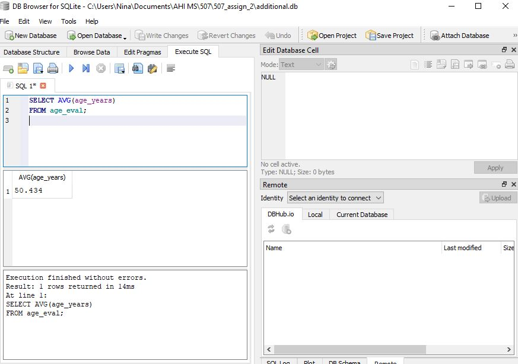

# 507 - Assignment 2
Goal is to create a stand-alone .sql schema for a single table 

Repo Scaffold 
| 507_assign_2 |  |
|----|----|
| data |  |
|  | patients.csv |
| images |  |
| | image files |
| sql |  |
|  | additional.sql |
|  | analysis.sql |
|  | schema.sql |
| src |  |
|  | create_db.py |
|  | import_csv.py |
| Eval.txt |  |
| additional.db | |
| clinic_simple.db |  |
| readme.md |  |
| requirements.txt |  |

Download links: 
DB Browser for SQLite: https://sqlitebrowser.org/dl/
Alternate to DB Browser for VS Code - SQlite Extension: https://marketplace.visualstudio.com/items?itemName=alexcvzz.vscode-sqlite 

## How to run code
1. Install requirements.txt in terminal 
   ```bash
   pip install -r requirements.txt
   ```
2. Run script to create the db file 
   ```bash
   python src/create_db.py
   ```
3. Load rows into db file 
   ```bash
   python src/import_csv.py
   ```
4. Open db file in DB Browser for SQlite 
5. To create and run queries input click on execute SQL and input the scripts seen in analysis.sql . Note: RUN ONLY QUERY CODE AT A TIME 


#### Alternate way to generate db via google colab 
1. Upload patients.csv into colab notebook
2. Input following codes
   ```bash
   import pandas as pd
   import sqlite3
   import sqlalchemy import create_engine
   import matplotlib.pyplot as plt
   ```
   ```bash
   data = pd.read_csv('/content/patients.csv')
   data
   ```
   ```bash
   sqlite3.connect('clinic_simple.db')
   ```
   ```bash
   conn = create_engine('sqlite:///clinic_simple.db')
   conn
   ```
   ```bash
   data.to_sql('clinic_simple.db', conn , if_exists='replace', index=False)
   ```

   Then download the generated db file 


#### Alternate way to view and run queries using VS code extension SQlite 


#### Additional analysis - Average age of patients
1. Go to execute sql and insert the following: 
```bash
SELECT
  patient_id,
  birth_date,
  last_visit_dt,
  CAST((julianday(date('now')) - julianday(birth_date)) / 365.25 AS INT) AS age_years
FROM patients
ORDER BY age_years DESC
```
2. Then export the result to csv
3. Go to file, import, and table from CSV file then select the new csv file
    Make sure column names in first line is checked off 
4. To calculate average based on new file go to execute sql and insert following code: 
```bash
SELECT AVG(age_years)
FROM age_eval;
```

## Query Results - see eval.txt for full results

#### Total amt of patients: 
Results that there is a total 500 total patients within records. 

500 


#### Top primary diagnoses by count: 

The most common primary diagnosis code is I10 which is hypertension.
| Primary_icd | Count |
|---|---|
|I10	| 81 |
|E11.9	| 73 |
|E78.5	| 62 |
|J45.909 | 46 |
|F41.9	| 33 |
|K21.9	| 30 |
|M54.5	| 26 |
|E03.9	| 22 |
|R51.9	| 21 |
|I25.10	| 21 |



#### Office-visit CPTs since Jan 1, 2025 (CPT codes starting with 992)
Most common cpt code with 992 is for outpatient or office visits. These visits are likely for follow-up or new chief complaint requiring evaluation. 

| patient_id	| last_cpt	| last_visit_dt |
|---|---|---|
| P0126	| 99213	| 2025-09-09 | 
| P0349	| 99213	| 2025-09-09 |
| P0383	| 99213	| 2025-09-09 |
| P0424	| 99213	| 2025-09-09 |
| P0282	| 99214	| 2025-09-08 |



#### Age (approx) at last visit for the 5 oldest patients
The 5 oldest patients at time of last visit are all aged 85. However pt P0372 has not made a visit within a year which would require follow-up call regarding status. If no update regarding status is found, case may require wellness-check from either police or adult protective services. 

| patient_id | birth_date |	last_visit_dt | age_years |
|---|---|---|---|
| P0027	| 1940-04-11 |	2024-09-27 | 85 |
| P0100	| 1940-10-06 |	2025-01-14 | 85 |
| P0108	| 1940-07-08 |	2025-01-09 | 85 |
| P0129	| 1940-04-15 |	2025-07-01 | 85 |
| P0372	| 1940-09-11 |	2024-04-18 | 85 |



#### Average age of patients (Additional)

Average age of patients within this dataset is 50 years.

Average age: 50.424 



### Brief overview and explanation

Primary findings within patient data show results such as patient identification number, date of birth, primary icd diagnosis, and last visit. Goal of this project is to convert a csv file into sql database. 